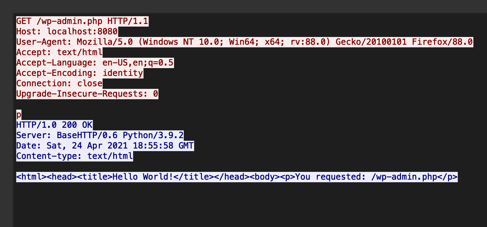

# WPICTF
## suspicious-traffic

Category | Points
--- | --- 
Steganography | 200

- Download the file
- Open it in ``Wireshark``
- Let's try to find some information in HTTP GET requests
- For each such request, follow TCP cause TCP is used for streaming
- Everything is dumped into a file and we see the symbol right above the answer

 
- If we look at all GET requests in a similar way, we collect the flag char by char

`flag=WPI{su3p1ci0uS_htTp}`